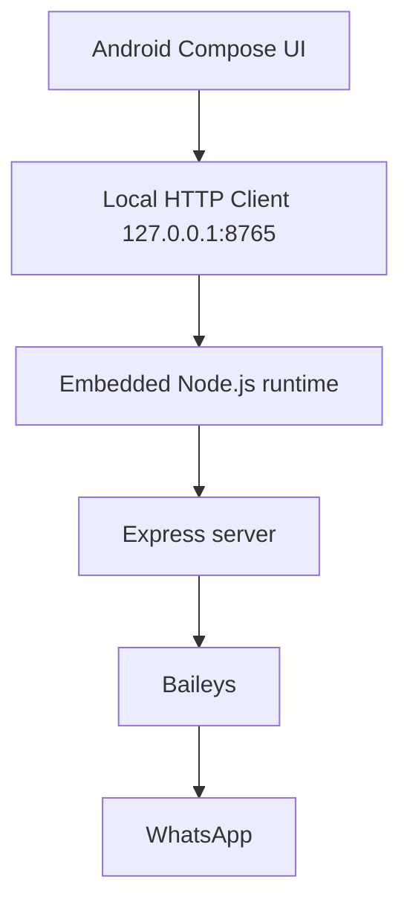

# AyX WhatsApp

A self-contained Android WhatsApp gateway powered by an embedded Node.js runtime and [Baileys](https://github.com/WhiskeySockets/Baileys). The entire WhatsApp engine runs **on-device** inside the app — no external server required.


---

## Overview

AyX WhatsApp embeds a full Node.js process (via [nodejs-mobile](https://github.com/nodejs-mobile/nodejs-mobile)) inside a native Android app. A Kotlin + Jetpack Compose UI talks to that runtime over a local HTTP interface on `127.0.0.1`. The Node process runs an Express server and the Baileys WhatsApp protocol client, kept alive by an Android foreground service.

---

## Architecture



| Layer | Responsibility |
|-------|----------------|
| **Compose UI** (Kotlin) | Screens, chat list, status, media pickers, settings |
| **Local HTTP client** | Calls the on-device gateway over `127.0.0.1:8765` |
| **Embedded Node.js** | Runs inside the app process via JNI + `libnode.so` |
| **Express** | Exposes the gateway REST endpoints |
| **Baileys** | Speaks the WhatsApp multi-device protocol |

---

## Features

### WhatsApp
- On-device WhatsApp linking (QR code **and** pairing code)
- Baileys multi-device connection
- Connection / registration state tracking
- Session persistence across restarts
- Foreground service (stays connected in the background)

### Chat
- Chat list with search
- Send / receive messages
- Media (image, video, audio, document) with download & share
- Reactions and native quoted replies
- Delete messages / delete chats
- Block / unblock, hide chat, lock chat (device credential)
- Anti-delete (keeps deleted messages)

### Contacts
- Android device contacts integration
- WhatsApp JID / phone-number mapping (including `@lid`)
- Local name-resolution cache
- Contact picker for new chats

### Status
- **My Status** and **Recent Updates**, grouped by contact (one row per person)
- WhatsApp-style status viewer (progress bars, tap / auto-advance, download)
- Status captions and status replies
- Post status to your real WhatsApp (image / video)
- Persistent status data across app updates

### Media
- Image processing and center-crop
- Photo to MP4 conversion (MediaCodec + OpenGL)
- Video / audio merge (MediaMuxer)

### Music
- **Add music** -> search -> play preview -> select
- Audio trimmer (select the clip used for a status)
- Selected + trimmed audio is merged into the final status video

### Auto-reply
- Keyword auto-replies
- Optional AI auto-reply (OpenAI-compatible endpoint, configurable)

---

## Project structure

```
.
|- app/
|  \- src/main/
|     |- java/ayx/whatsapp/     # Kotlin + Compose (UI, gateway client, media tools)
|     |- cpp/                   # JNI bridge to libnode.so (CMake)
|     \- res/                   # icons, themes, file_paths
|- nodejs-project/
|  |- main.js                   # Express + Baileys gateway
|  \- package.json              # Node dependencies
|- .github/workflows/build.yml  # CI: build signed release APK
|- gradle/
\- build.gradle.kts
```

---

## Build (GitHub Actions)

The app is built entirely in CI - the NDK toolchain, `libnode.so`, and the bundled Node project are all assembled by the workflow.

1. Push to the repository (branch `main`).
2. GitHub -> **Actions** -> **Build APK** workflow runs.
3. Wait for the run to finish **green**.
4. The signed APK is published to the repository **Releases**.
5. Download and install the APK.

Signing is handled through repository **Secrets**: `KEYSTORE_B64`, `KEYSTORE_PASSWORD`, `KEY_ALIAS`, `KEY_PASSWORD`.

---

## Installation

1. Download the signed APK from **Releases**.
2. Install it (allow installation from unknown sources if prompted).
3. Launch the app and grant the permissions it requests:
   - Notifications
   - Contacts (for name resolution)
   - Camera (for capturing photos / videos)
4. The embedded gateway starts automatically (foreground service).
5. Link WhatsApp (see below) and wait for the connection to become **connected**.

---

## Linking WhatsApp

On first launch the app is unlinked. Connect using either method:

- **QR code** - scan it from *WhatsApp -> Linked devices -> Link a device*.
- **Pairing code** - enter your number in the app to receive an 8-character code, then enter it in *WhatsApp -> Linked devices -> Link with phone number*.

The session is stored on-device and restored on the next launch.

---

## Gateway API

The embedded Express server (bound to `127.0.0.1:8765`) exposes the following endpoints, consumed only by the app itself.

| Endpoint | Method | Purpose |
|----------|--------|---------|
| `/health` | GET | Runtime health check |
| `/status` | GET | Connection / registration state |
| `/qr.png` | GET | QR image for linking |
| `/pair` | POST | Request a pairing code |
| `/logout` | POST | Unlink the session |
| `/me` | GET | Own JID / name |
| `/messages` | GET | Recent messages |
| `/deleted` | GET | Deleted (anti-delete) messages |
| `/send` | POST | Send a text message |
| `/sendraw` | POST | Send raw text to a JID |
| `/sendreply` | POST | Send a quoted reply |
| `/sendmedia` | POST | Send media |
| `/message/delete` | POST | Delete a message |
| `/chat/delete` | POST | Delete a chat |
| `/react` | POST | React to a message |
| `/block` | POST | Block / unblock a contact |
| `/contacts` | GET | Known contacts |
| `/onwhatsapp` | POST | Check numbers on WhatsApp (returns JID / LID) |
| `/presence` | GET | Presence (online / last seen) |
| `/dp` | GET | Profile photo for a JID |
| `/media/:name` | GET | Fetch downloaded media |
| `/statuses` | GET | Status updates (grouped by contact) |
| `/status/post` | POST | Post a status (image / video) |
| `/status/delete` | POST | Delete own status |
| `/settings` | GET / POST | Read / update gateway settings |
| `/profile/name` | POST | Update profile name |
| `/profile/bio` | POST | Update profile bio |
| `/profile/picture` | POST | Update profile photo |
| `/session/export` | GET | Export session |
| `/session/import` | POST | Import session |
| `/music/search` | GET | Search music (for status audio) |

---

## Technology stack

| Component | Technology |
|-----------|------------|
| Android UI | Kotlin, Jetpack Compose (Material 3) |
| Gateway | Node.js, Express |
| WhatsApp | Baileys |
| Native runtime | nodejs-mobile (`libnode.so`), C/C++ JNI bridge (CMake) |
| Media | Android MediaCodec / MediaMuxer / OpenGL ES |
| Build & CI | Gradle (AGP 8.4), GitHub Actions |

---

## Disclaimer

This project uses an unofficial WhatsApp protocol library and is intended for personal / educational use. It is not affiliated with or endorsed by WhatsApp or Meta.
